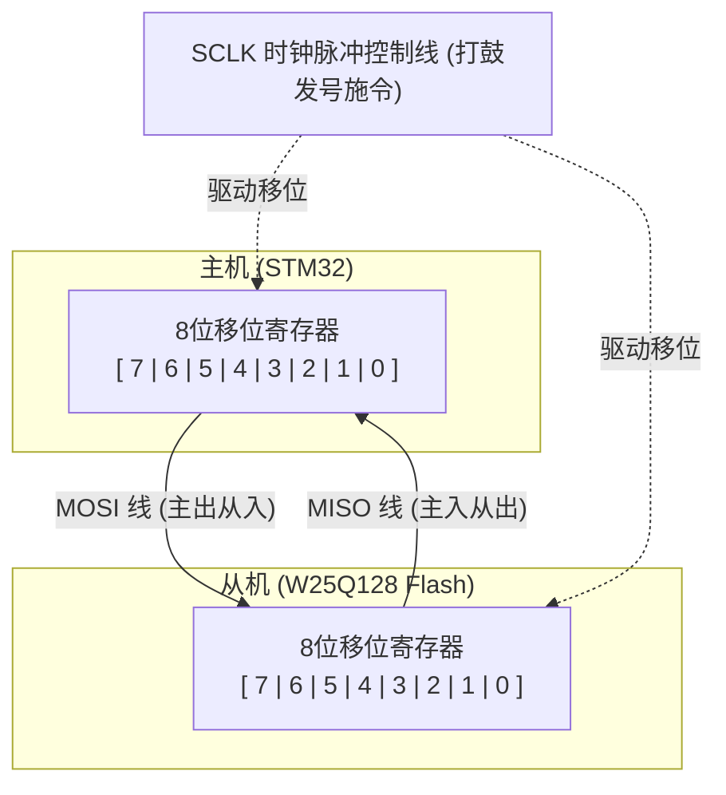

# SPI 串行通信终极通俗大师课 (SPI Masterclass)

本篇文档将为您彻底揭开 SPI 通信的神秘面纱。我们不使用晦涩难懂的学术词汇，而是结合直观的图表和硬件事实，帮您建立起终生难忘的 SPI 知识网络。

---

## 🧭 一、 什么是 SPI？（缩写与字面含义）

**SPI** 的全称是：**Serial Peripheral Interface**。

我们将这三个单词拆开来理解，它的含义就变得非常直白：

1. **Serial (串行)**：
   * **字面意思**：排成一列、一个接一个。
   * **硬件含义**：数据像排队出城一样，**在单根信号线上，按位（bit-by-bit）一位一位地依次传输**。与它相对的是 Parallel（并行通信，即用 8 根线同时发送 8 个 bit）。
2. **Peripheral (外设)**：
   * **字面意思**：外围设备、周边器件。
   * **硬件含义**：连接在单片机核心外围的各种功能芯片，比如存储芯片（W25Q128 Flash）、液晶屏（LCD）、温湿度传感器、无线收发器等。
3. **Interface (接口)**：
   * **字面意思**：接触面、连接协议。
   * **硬件含义**：两个芯片之间进行对话所必须遵守的“物理接线引脚标准”和“交谈规矩（时序）协议”。

> **💡 总结**：**SPI** 字面意思就是 **“串行外设接口”**。它是专为单片机与外围各种功能芯片之间进行**超高速、近距离、双向通信**而设计的一套物理接线与对话规矩。

---

## 🔄 二、 核心机制：环形移位寄存器 (Mermaid 时序解析)

SPI 通信跟其他总线（如 I2C、串口）最根本的区别，在于它底层的**硬件设计哲学**——**“数据对调”**。

在主芯片（Master）和外设芯片（Slave）内部，各有一个 **8 位的移位寄存器**。当通信开启时，这两张寄存器通过 `MOSI` 和 `MISO` 两根线首尾相连，组成了一个**闭环的环形列车轨道**：

### 1. 数据的“环形对调”是如何发生的？
* **打鼓发令**：主机每在 `SCLK` 上产生一个时钟脉冲（敲一下鼓）：
  * **主机的最高位（第7位）** 就会从 `MOSI` 线“滑出”，进入**从机的最低位（第0位）**。
  * 同时，**从机的最高位（第7位）** 也会从 `MISO` 线“滑出”，进入**主机的最低位（第0位）**。
  * 剩下所有中间的 bit 顺次往左移动一位。
* **八次闭环，完美对调**：
  当 `SCLK` 连续敲击 8 下（8个脉冲）后，两边的 8 个 bit 刚好在环形轨道上转了完整的一圈。
  此时：**主机原先的字节被毫无保留地塞给了从机，而从机原先的字节也被完美换回到了主机！**

### 2. 派生出的 SPI 通信铁律：
* **发送即接收**：主机只要向 MOSI 线上发送 1 个字节，它手里的 MISO 线上必定同时被塞回来 1 个字节。
* **接收必发送**：如果主机只想读取从机的数据，它也必须“假装”发送一个毫无意义的废数据（比如 `0xFF`）出去，目的纯粹是为了**给时钟线 SCLK 提供 8 个脉冲，把外设里的数据“泵”回来**。

---

## 🔌 三、 四根引脚：各司其职的“四位金刚”

SPI 经典的 4 线接口中，每一根线都承担着不可替代的物理职责：

| 引脚名称 | 缩写全称 | 信号方向 | 物理职责（通俗解释） |
| :--- | :--- | :--- | :--- |
| **SCLK** | **S**erial **C**lock | 主机 ➔ 从机 | **同步时钟鼓点线**。节奏由主机唯一决定。敲一下鼓，数据就挪动 1 位。没有时钟，数据就无法流动。 |
| **MOSI** | **M**aster **O**ut, **S**lave **I**n | 主机 ➔ 从机 | **主机输出、从机输入线**。专用于主机向从机发送控制指令或写入数据。 |
| **MISO** | **M**aster **I**n, **S**lave **O**ut | 从机 ➔ 主机 | **主机输入、从机输出线**。专用于从机向主机汇报数据、返回传感器状态。 |
| **/CS** 或 **NSS** | **C**hip **S**elect (片选) | 主机 ➔ 从机 | **从机点名控制线**。低电平有效。平时为高电平 1；主机想和哪个芯片说话，就把该线拉低到 0。没被点名的从机必须闭嘴（引脚设为高阻态隔离）。 |

---

## ⚙️ 四、 四种时序模式：CPOL 与 CPHA 的交谊舞步

要让两个芯片无误差地收发二进制数据，必须约定好：**“我们在时钟信号跳变的哪个瞬间，去读取线上的电平？”**。这就是通过 **CPOL（极性）** 和 **CPHA（相位）** 组合出来的 4 种工作模式：

1. **CPOL (Clock Polarity，时钟极性)**：空闲时（音乐未响起），时钟线 SCLK 默认停留在什么电平？
   * `0`：空闲为**低电平**
   * `1`：空闲为**高电平**
2. **CPHA (Clock Phase，时钟相位)**：在一拍时钟脉冲里，我们在第几个电平跳变沿（Edge）去读取（采样）数据？
   * `0`：在**第 1 个沿**采样数据
   * `1`：在**第 2 个沿**采样数据

### 📋 4 种模式详析速查表：

| 模式 (Mode) | CPOL (空闲电平) | CPHA (采样沿) | 数据采样沿 (读数瞬间) | 数据变化沿 (写数瞬间) |
| :---: | :---: | :---: | :---: | :---: |
| **Mode 0** (最常用) | **0 (低电平)** | **0 (第1个沿)** | **上升沿** | 下降沿 |
| Mode 1 | 0 (低电平) | 1 (第2个沿) | 下降沿 | 上升沿 |
| Mode 2 | 1 (高电平) | 0 (第1个沿) | 下降沿 | 上升沿 |
| **Mode 3** (最常用) | **1 (高电平)** | **1 (第2个沿)** | **上升沿** | 下降沿 |

> **💡 行业默契**：世界上绝大多数 SPI 芯片（包括我们的 W25Q128 Flash 芯片）都支持 **Mode 0** 和 **Mode 3**。
> **秘密在于**：这两个模式的数据采样点都是 **“上升沿”**。在数字电路中，由低变高的上升沿瞬间，电平跳变最为坚决、平稳，信号最不容易受到寄生电容和噪声的干扰，因此数据传输极度安全、稳定。

---

## 💾 五、 W25Q128 Flash 存储结构与擦除规则

在我们的单片机外挂 W25Q128 闪存芯片时，必须掌握它的物理结构和特殊的“写前必擦”铁律。

### 1. 物理划分与容量计算
W25Q128 的总容量是 **128Mbit = 16MB**。
它的物理空间从大到小被严格切分：
* **Block（块）**：共有 **256 块**。每一块的大小为 **64KB**。
* **Sector（扇区）**：每块包含 16 个扇区，总共 **4096 扇区**。每个扇区大小为 **4KB**。
* **Page（页）**：每个扇区包含 16 个页，总共 **65536 页**。每页大小为 **256字节**。

### 2. ⚠️ “写前必擦，擦除为1” 的硬件死律：
* **为什么写之前必须擦除？**
  * Flash 芯片在存储数据时，其内部物理栅极只能实现**“把 1 烧断写成 0”**，它**没有办法**单独把某个 `0` 变回 `1`。
  * 如果不擦除直接覆盖写入，比如原本存的是 `0xFE` (二进制 `1111 1110`)，您想写入 `0x0F` (二进制 `0000 1111`)，拼在一起写入后，硬件只能改写 `0`，结果就会变成 `0x0E` (二进制 `0000 1110`，完全错乱！)。
  * **解决方案**：使用高压把这一片物理栅极全部复位。这个动作叫**“擦除”**。擦除后，所有的 bit 都会被强行恢复成最初的 **`1`（全变成 `0xFF`）**。接着，我们再把需要写 `0` 的位写成 `0` 即可。
* **擦除的最小单位**：
  * W25Q128 擦除的最小物理单位是 **1 个扇区（4KB）**。
  * 所以哪怕您只想修改里面的 **1 个字节**，也必须先把这整整 **4096 个字节全部擦成 0xFF**，然后再把您的新数据和原来未被修改的数据一起全部重写进去。这就是 Flash 的工作代价。
