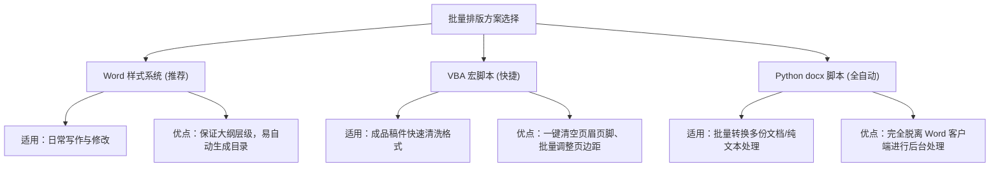

# 毕业论文一键批量排版方案与高效排版指南

为了帮您从繁琐的机械性排版工作中解脱出来，我为您总结了三种主流且高效的**批量格式修改方法**。

本教程的完整 Markdown（标记语言）格式脚本已同步保存至您的工作区中，方便在 IDE（Integrated Development Environment，集成开发环境）中查看：
[论文一键批量排版教程与脚本.md](file:///d:/project_stm32/0.记忆空间/论文一键批量排版教程与脚本.md)

---

## 🛠️ 三种批量排版方案对比



---

## 📋 方案详细说明

```carousel
### 方案一：使用 Word 内置“样式（Styles）”功能（首选方案）
* **原理**：修改 Word 的“正文”与“标题”全局模板，实现“一改全改”。
* **操作步骤**：
  1. 在 Word 的“**开始**”面板中，右键点击“**正文**”（或“Normal”），选择“**修改**”。
  2. 设置字体：中文选“五号宋体”，英文/数字选“五号 Times New Roman”。
  3. 设置段落：点击左下角“格式” $\rightarrow$ “段落”，将特殊格式设为“首行缩进 2 字符”，行距设为“**固定值 20 磅**”。
  4. 点击确定，文档中所有普通文本将在 1 秒内**自动批量格式化**！
* **同理**：可对“标题 1”、“标题 2”等批量设置对应的黑体字号，方便后续自动提取目录。

<!-- slide -->

### 方案二：VBA 宏脚本一键自动排版（最省力）
* **原理**：利用 Word 内置的 **VBA（Visual Basic for Applications，针对微软 Office 软件的宏编程语言）** 脚本，一键完成页面配置与内容清理。
* **操作步骤**：
  1. 在 Word 中按下 **Alt + F11** 键打开 VBA（Visual Basic for Applications，针对微软 Office 软件的宏编程语言）编辑器。
  2. 点击菜单栏“**插入 (Insert)**” $\rightarrow$ “**模块 (Module)**”。
  3. 粘贴我为您写好的 VBA（Visual Basic for Applications，针对微软 Office 软件的宏编程语言）宏脚本（见本地工作区文件）。
  4. 按下 **F5** 键运行，页边距、对称页边距、行距、以及页眉页脚的批量清除将瞬间全部完成！

<!-- slide -->

### 方案三：使用 Python 脚本编程排版（高阶自动化）
* **原理**：使用 Python（Python Programming Language，通用高级编程语言）的 **`python-docx`** 库，直接对 `.docx` 格式文档的 XML 树进行解析和属性重设。
* **适用场景**：
  * 有多份论文初稿需要并行格式化；
  * 需要将 Markdown（标记语言）源码批量转换并渲染为符合学校规范的 `.docx` 文件。
* **操作方式**：
  * 在终端安装依赖：`pip install python-docx`
  * 编写 Python 转换脚本（具体代码已为您保存在本地 [论文一键批量排版教程与脚本.md](file:///d:/project_stm32/0.记忆空间/论文一键批量排版教程与脚本.md) 中）。
```

---

> 💡 **排版避坑小建议**：
> 1. **先用样式，再微调**：强烈建议在开始写作时，就使用 Word 的样式窗格给不同层级的标题和正文打上“标签”，这能保证文档结构高度一致，绝对不会在后期生成目录或改版时崩溃。
> 2. **清除多余空行**：段落之间不要使用连续回车来制造空行，多使用段前段后间距，这在批量修改固定行距时能避免大量格式问题。
