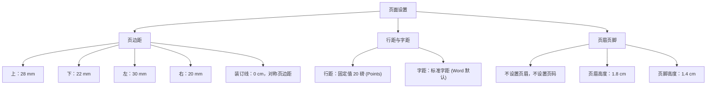

# 2026届本科优秀毕业论文（设计）稿件规范与写作指南

本指南根据您提供的毕业论文（设计）稿件要求精细整理，结合您的实际毕业设计选题 **《基于 Spring Boot+Vue 的多模态 AI 图库系统的设计与实现》** 进行了深度定制。

该指南的 Markdown 格式版本已同步为您保存在工作区：
[2026届本科优秀毕业论文稿件要求与模板.md](file:///d:/project_stm32/0.记忆空间/2026届本科优秀毕业论文稿件要求与模板.md)

---

## 📐 页面与版面核心设置

在撰写与排版时，请务必在 Microsoft Word 中完成以下页面参数设置：



---

## ✍️ 论文多级标题及正文字体要求

对于您的理工科课题，论文序号编排必须严格采用 **理工类规范**。具体格式规范如下：

```carousel
### 1. 论文前置部分格式
* **论文题目**：`三号黑体`，加粗，居中。
* **副标题**（如有）：`小三号黑体`，居中。
* **（间隔一行）**
* **班级与署名**：`班级：XXXXXX  学生姓名：XXX  指导教师：XXX`（`小四号楷体`，居中）。
* **（间隔一行）**
* **中文摘要**：
  * “**摘要**”二字：首行缩进 2 字符，`小四号黑体`。
  * 摘要正文：`五号楷体`，首行缩进 2 字符。
* **中文关键词**：
  * “**关键词**”三字：首行缩进 2 字符，`小四号黑体`。
  * 关键词正文：`五号楷体`，首行缩进 2 字符，半角分号隔开。

<!-- slide -->

### 2. 正文多级标题与内容格式
* **一级标题**：**4 号黑体**（例如：`1. 绪论`）。
* **二级标题**：**小 4 号黑体**（例如：`1.1 系统总体方案设计`）。
* **三级标题**：**小 4 号黑体**（例如：`1.1.1 控制核心选型`）。
* **四级标题**：**5 号黑体**（例如：`1.1.1.1 主控芯片对比`）。
* **正文内容**：
  * 中文：**5 号宋体**。
  * 英文与数字：**Times New Roman**。
  * 段落格式：**首行缩进 2 字符**，行距**固定值 20 磅**。
* **（每大章前/后或参考文献等大模块之间需间隔一行）**

<!-- slide -->

### 3. 图表与参考文献格式
* **图表要求**：
  * 只附最必要的图表，全文**连续编号**（例如：`图1`、`图2`，`表1`、`表2`），不得按章节编号。
  * 图题置于图片**下方**（居中），表题置于表格**上方**（居中）。
* **参考文献格式**：
  * 与正文内容**间隔一行**，标题为“**参考文献**”（`四号黑体`，居中）。
  * 列表字体：**五号宋体**（英文为 Times New Roman）。
  * 列表格式：使用 `[1]`、`[2]` 连续编号，**编号后必须空 1 个汉字字距**再书写。
  * 段落缩进：**悬挂缩进 2 字符**。
* **译文部分（置于参考文献后，间隔一行）**：
  * **Title**（英文题目）：`三号 Times New Roman`，加粗，居中。
  * **subtitle**（英文副标题）：`小三号 Times New Roman`，加粗，居中。
  * **Abstract**（英文摘要）：“**Abstract**”一词`小四号 Times New Roman`加粗，首行缩进 2 字符；正文`小四号 Times New Roman`。
  * **Key Words**（英文关键词）：“**Key Words**”一词`小四号 Times New Roman`加粗，首行缩进 2 字符；正文`小四号 Times New Roman`。
```

---

## 🛠️ 毕业论文结构设计方案（《基于 Spring Boot+Vue 的多模态 AI 图库系统的设计与实现》）

为了让您的毕业论文在技术完整性与学术深度上达到优秀标准，特别为您设计了以下这套包含**软件架构、大文件切片上传、JWT 双令牌鉴权、CLIP 多模态提取与 Milvus 向量库相似度检索**的核心功能架构与论文大纲：

```markdown
1. 绪论
   1.1 课题研究背景及意义
   1.2 国内外研究现状
       1.2.1 传统网络图库管理系统检索技术现状
       1.2.2 多模态 AI（Artificial Intelligence，人工智能）技术在图库中的应用现状
   1.3 论文主要研究内容与章节安排

2. 相关技术与理论基础
   2.1 后端开发技术
       2.1.1 Spring Boot（Spring Boot Framework，基于 Java 的后端轻量级快速开发框架）介绍
       2.1.2 MyBatis-Plus（MyBatis-Plus Database Toolkit，基于 MyBatis 增强的数据库持久层开发工具）介绍
   2.2 前端开发技术
       2.2.1 Vue（Vue.js Framework，前端渐进式 JavaScript 框架）及生态介绍
       2.2.2 Element Plus（Element Plus UI Library，基于 Vue 3 的组件库）介绍
   2.3 多模态 AI（Artificial Intelligence，人工智能）技术理论
       2.3.1 CLIP（Contrastive Language-Image Pre-training，对比语言-图像预训练模型）原理
       2.3.2 向量检索技术与 Milvus（Milvus Vector Database，开源向量数据库）介绍
   2.4 其它支撑技术
       2.4.1 Redis（Remote Dictionary Server，远程字典服务内存数据库）缓存机制
       2.4.2 MinIO（MinIO Object Storage Service，开源对象存储服务）对象存储

3. 系统需求分析与总体设计
   3.1 系统需求分析
       3.1.1 业务流程分析
       3.1.2 系统功能性需求分析
       3.1.3 系统非功能性需求分析
   3.2 系统总体架构设计
       3.2.1 系统技术架构设计
       3.2.2 多模态 AI（Artificial Intelligence，人工智能）计算架构设计
   3.3 系统功能模块设计
       3.3.1 用户认证与管理模块
       3.3.2 图片上传与元数据解析模块
       3.3.3 多模态 AI（Artificial Intelligence，人工智能）智能检索模块
       3.3.4 智能相册与分类标签模块
   3.4 数据库设计
       3.4.1 关系型数据库 MySQL（MySQL Relational Database Management System，开源关系型数据库管理系统）概念结构设计
       3.4.2 数据库逻辑结构设计（核心数据表结构）
       3.4.3 Milvus（Milvus Vector Database，开源向量数据库）向量库集合设计

4. 系统核心功能设计与实现
   4.1 前端基础框架搭建与核心页面实现
       4.1.1 Vue（Vue.js Framework，前端渐进式 JavaScript 框架）项目初始化与路由管理
       4.1.2 响应式瀑布流图片展示界面实现
   4.2 后端服务搭建与基础功能实现
       4.2.1 Spring Boot（Spring Boot Framework，基于 Java 的后端轻量级快速开发框架）项目搭建及底层封装
       4.2.2 基于 JWT（JSON Web Token，基于 JSON 的开放标准跨域认证令牌）的双令牌用户鉴权机制实现
       4.2.3 基于 MinIO（MinIO Object Storage Service，开源对象存储服务）的大文件切片上传与异步持久化
   4.3 多模态 AI（Artificial Intelligence，人工智能）核心算法集成与检索实现
       4.3.1 基于 CLIP（Contrastive Language-Image Pre-training，对比语言-图像预训练模型）的跨模态特征提取服务搭建
       4.3.2 “以文搜图”与“以图搜图”特征检索算法实现
       4.3.3 基于 Milvus（Milvus Vector Database，开源向量数据库）的高效向量索引与相似度检索实现
   4.4 自动化智能标注与分类实现
       4.4.1 基于目标检测算法的图片标签自动提取与入库
       4.4.2 智能动态虚拟相册聚合算法

5. 系统功能测试与性能优化
   5.1 系统功能测试
       5.1.1 图片多模态检索功能测试
       5.1.2 自动化标签提取与分类测试
       5.1.3 大文件并发上传测试
   5.2 系统性能测试与分析
       5.2.1 向量检索在高并发场景下的响应延时测试
       5.2.2 内存数据库 Redis（Remote Dictionary Server，远程字典服务内存数据库）缓存优化效果对比
   5.3 系统安全性与稳定性分析

6. 结论与展望
   6.1 全文工作总结
   6.2 存在的问题与下一步工作展望
```

---

> 💡 **Antigravity 伴写承诺**：
> 在接下来的论文撰写过程中，我会时刻铭记这套稿件参数要求。无论您让我帮您**撰写需求分析**、**设计数据库核心表结构**、**理清 CLIP 模型特征工程**，还是**规范参考文献格式**，我都会按照这套规范帮您生成排版优美、格式精准的文本，做您最贴心的毕业设计辅导助手！
