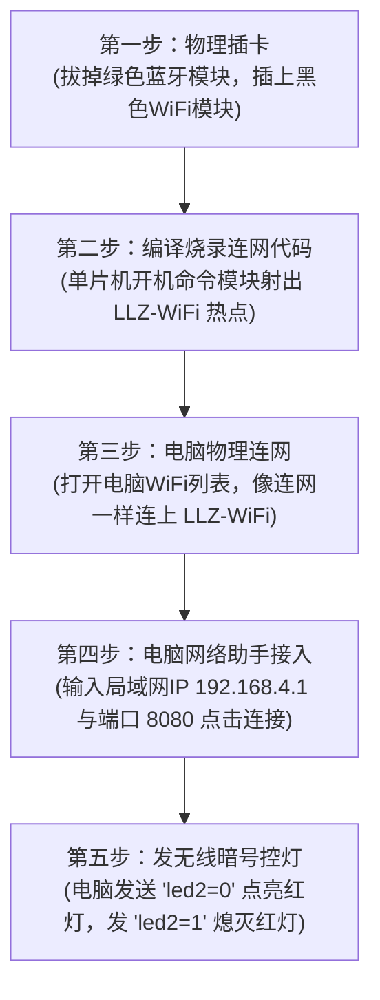

# 🌟 STM32 进阶网络开发笔记
## 🏷️ 主题：ESP8266 WiFi 模块 SoftAP 局域网无线控灯

> [!IMPORTANT]
> **本篇笔记的终极理念**：用最通俗的人话，拆解“搞这个模块的目的是什么”以及“我们物理上究竟该怎么一步步操作”。

---

## 🎯 一、 搞这个 WiFi 模块的【终极目的】是什么？

用一句话概括就是：
**“丢掉一切USB数据线，让【我的电脑】发射无线电波，像网聊一样去遥控点亮/熄灭【单片机开发板】上的小红灯！”**

### 💡 核心细节拆解：
*   **不借用任何外部路由器**：我们不需要借助教室里或家里的 WiFi 路由器。
*   **开发板自己当“基站”**：黑色的 **`ESP8266（ESP8266 WiFi System on Chip，ESP8266无线局域网单芯片系统）`** 模块在通电后，会自己对外物理发射一个叫做 **`LLZ-WiFi`** 的无线热点。
*   **电脑直接物理接入**：你的电脑只要连接这个热点，你们两个就组成了一个“面对面物理局域网”。
*   **发送特定暗号控灯**：在电脑上无线发送特定的字符暗号（如发 `led2=0`），开发板接收到后就会把相应的 **`LED（Light Emitting Diode，发光二极管灯）`** 灯泡点亮！

---

## 🏃 二、 物理上手：【人话版】极简操作流程

老大，你在实际动手时，只需要雷打不动地执行以下五步：



### 📋 详细人话步骤说明：

*   **【第一步：物理插卡】**：
    把你的开发板断电。**拔掉绿色蓝牙模块**，在同一个插槽位置上，**换插上这块带有金色曲折天线的黑色 ESP8266 WiFi 模块**。
*   **【第二步：编译烧录连网代码】**：
    编写 **`C（C Programming Language，C语言）`** 代码并通过 **`Keil MDK（MDK-ARM Microcontroller Development Kit，Keil微控制器开发套件）`** 烧录进 **`STM32（STMicroelectronics 32-bit Microcontroller，意法半导体32位微控制器）`** 中。
    *   *单片机跑起代码后会干什么？*：它会自动通过串口给这块 WiFi 模块下达命令：“现在变身路由器！立刻向空气中射出名为 `LLZ-WiFi`、密码为 `88888888` 的无线热点！”。
*   **【第三步：电脑物理连网】**：
    转到你的 **`PC（Personal Computer，个人电脑/上位机）`** 电脑上，点击右下角无线图标。在 WiFi 信号列表里会刷出一个叫做 **`LLZ-WiFi`** 的新名字，点击连接，密码输入 **`88888888`**。
*   **【第四步：电脑网络助手接入】**：
    在电脑上双击打开“网络调试助手”软件。协议选择 **`TCP Client（传输控制协议客户端）`**。目标网络 **`IP（Internet Protocol，网际协议/网络地址码）`** 填入默认局域网大本营地址：**`192.168.4.1`**，目标端口输入：**`8080`**，点击“连接”。
*   **【第五步：发无线暗号控灯】**：
    网络通道通车后，在发送框内敲入 `led2=0` 并点击发送。单片机的串口中断就会在后台物理拦截这个数据包，执行关灯/开灯动作，红灯瞬间闪亮！

---

## 📜 三、 幕后黑手：常用配置暗号（AT 指令）速查

这些就是单片机悄悄发给 WiFi 模块的变身指令，我们来揭开它的面纱：

| 配置指令 | 物理作用（大白话翻译） |
| :--- | :--- |
| **`AT+CWMODE=2\r\n`** | **“变身路由器！”** 开启 **`SoftAP（Software Access Point，软无线访问接入点）`** 热点模式，开始广播 WiFi 信号。 |
| **`AT+CWSAP="LLZ-WiFi","88888888",1,4\r\n`** | **“贴上无线门牌！”** 命名发射的无线信号为 `LLZ-WiFi`，连网暗号为 `88888888`。 |
| **`AT+CIPMUX=1\r\n`** | **“开启多路分身！”** 允许多个客户端（手机/电脑）在同一个局域网里接入进行控制。 |
| **`AT+CIPSERVER=1,8080\r\n`** | **“前台开门营业！”** 部署局域网内部的 **`TCP（Transmission Control Protocol，传输控制协议）`** 服务器，监听来自端口 `8080` 的网络请求。 |
| **`AT+RESET\r\n`** | **“重启物理落地！”** 重新启动无线模块芯片，使上述设置存入闪存并在空中物理生效广播。 |

---

## 🧠 四、 极简核心代码逻辑剖析

下面是你的单片机是如何通过串口无线拦截暗号并拉低电平的黄金逻辑代码：

```c
// 1. 命令 WiFi 模块开机变身
void esp8266_ap_init(void)
{
    delay_ms(1000); // 延时等待模块通电自检稳定
    
    usart_send_string(USART3, "AT+CWMODE=2\r\n"); // 切换为热点广播状态
    delay_ms(500);
    
    usart_send_string(USART3, "AT+CWSAP=\"LLZ-WiFi\",\"88888888\",1,4\r\n"); // 强行写入 LLZ 专属信号名
    delay_ms(500);
    
    usart_send_string(USART3, "AT+CIPMUX=1\r\n"); // 允许多连接
    delay_ms(500);
    
    usart_send_string(USART3, "AT+CIPSERVER=1,8080\r\n"); // TCP 服务器在 8080 端口开张！
    delay_ms(500);
}

// 2. 串口 3 接收中断（拦截暗号的神经中枢）
void USART3_IRQHandler(void)
{
    static char rx_buf[64] = {0}; // 物理数据小木桶
    static uint8_t rx_cnt = 0;
    uint8_t temp = 0;

    if (USART_GetITStatus(USART3, USART_IT_RXNE) == SET)
    {
        temp = USART_ReceiveData(USART3);
        
        if (rx_cnt < 63)
        {
            rx_buf[rx_cnt++] = temp; // 收集网线上传来的字节
        }
        
        // 👇 核心拦截匹配：看发来的话里有没有藏着控灯暗号！
        if (strstr(rx_buf, "led2=0") != NULL)
        {
            PFout(10) = 0; // 物理拉低 PF10，点亮红色 LED1 灯泡！
            memset(rx_buf, 0, sizeof(rx_buf));
            rx_cnt = 0;
        }
        else if (strstr(rx_buf, "led2=1") != NULL)
        {
            PFout(10) = 1; // 物理拉高 PF10，熄灭红色 LED1 灯泡！
            memset(rx_buf, 0, sizeof(rx_buf));
            rx_cnt = 0;
        }
        
        // 自动溢出保护
        if (rx_cnt >= 60)
        {
            memset(rx_buf, 0, sizeof(rx_buf));
            rx_cnt = 0;
        }

        USART_ClearITPendingBit(USART3, USART_IT_RXNE);
    }
}
```
